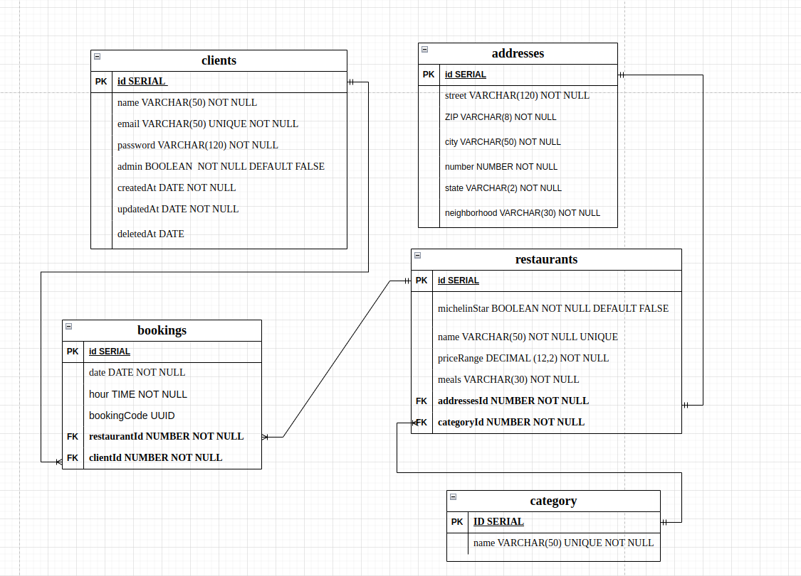

# RestaurantAPI

<h1>API para cadastrar clientes,restaurantes, categorias e realizar reservas</h1>

<h3>Descrição da aplicação:</h3>

Esta API REST  é responsável por gerenciar os serviços de restaurantes. Através da aplicação, é possível realizar o cadastro de restaurantes e clientes interessados em realizar reservas em restaurantes. Além disso, é possível realizar a reserva e consultar os seus respectivos horários disponíveis no banco de dados do restaurante. Nesta API, utilizei o TYPEORM  como ORM para fazer a interação com o banco de dados, serialização de dados com ZOD, utilização de postgresql como banco de dados, json web token para gerar tokens criptografados, dotenv para proporcionar a segurança dos dados sensíveis,bcrypt js para executar o hash da senha e express-async-errors para personalizar os erros na aplicação. 

<h2>Endpoints da API:</h2>

| Método | Endpoint                     | Descrição                                                  | Autenticação e Autorização               |
| ------ | ---------------------------- | ---------------------------------------------------------- | ---------------------------------------- |
| GET    | /clientes                    | Retorna todos os clientes cadastrados                      | Apenas administradores                   |
| GET    | /clientes/{id}               | Retorna um cliente específico pelo ID                      | Admins e donos da conta                  |
| POST   | /clientes                    | Cadastra um novo cliente                                   | Qualquer cliente, token não é necessário |
| PATCH  | /clientes/{id}               | Atualiza os dados de um cliente específico                 | Admins e donos da conta                  |
| DELETE | /clientes/{id}               | Realiza um soft delete no cliente                          | Admins e donos da conta                  |
| POST   | /login                       | Gerar um token de autenticação                             | Qualquer cliente, token não é necessário |
| POST   | /categories                  | Criação de uma categoria para o restaurante                | Apenas administradores                   |
| GET    | /categories                  | Lista todos as categorias                                  | Qualque cliente,token não é necessário   |
| GET    | /categories /{id}/restaurant | Listar todos os restaurantes que pertencem a uma categoria | Qualquer cliente,token não é necessário  |
| POST   | /restaurant                  | Cria um restaurante                                        | Apenas administradores                   |
| GET    | /restaurant                  | Lista todos os restaurantes                                | Qualquer cliente,token não é necessário  |
| POST   | /bookings                    | Faz uma reserva a um restaurante                           | Qualquer cliente,token é obrigatório     |
| GET    | /bookings/restaurant/{id}    | Lista todos as reservas de um restaurante                  | Apenas Administradores                   |

## Diagrama de Entidades e Relacionamentos:

<h2>Passos para a API rodar:</h2>

<ul>

<li>
Clone o reposítório de forma local
</li>
<li>Utilize o comando npm install para instalar todas as dependências</li>
<li>Utilize o comando npm run typeorm migration:run -- -d ./src/data-source para rodar as migrações </li>
<li>Para rodar o servidor, utilize o npm run dev</li>
<ul>
